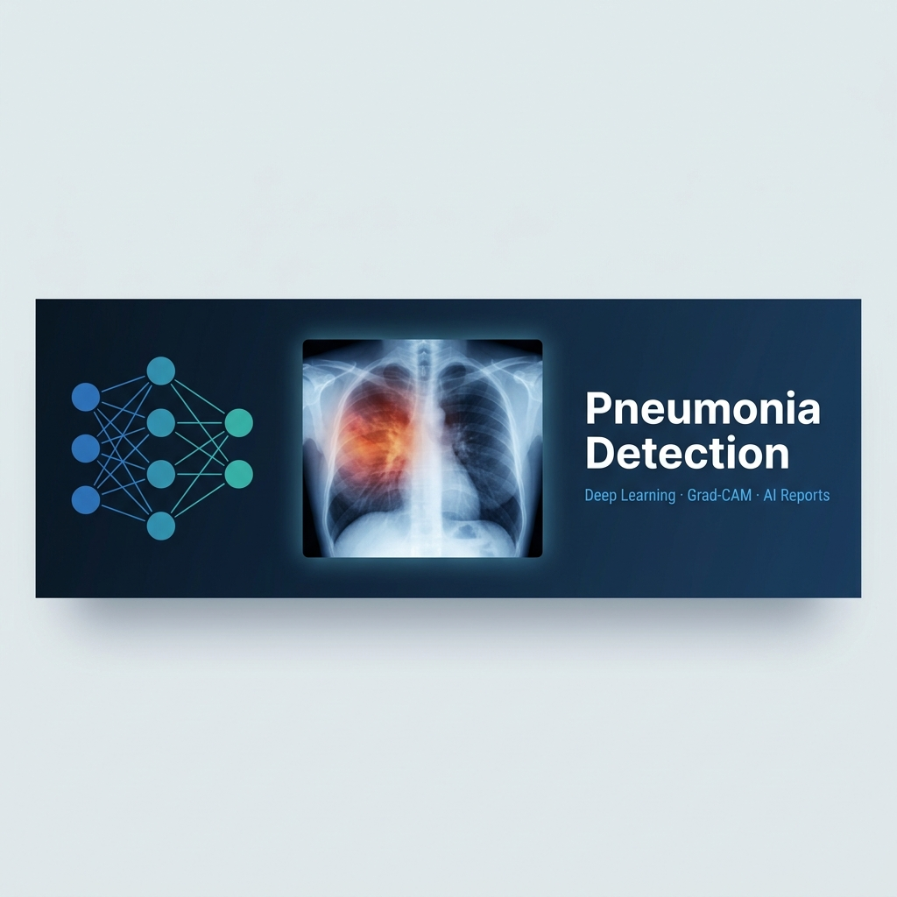

<p align="center">
  
</p>

<p align="center">
  
  
  
  
  
</p>

<h1 align="center">🫁 Pneumonia Detection Using Deep Learning</h1>

<p align="center">
  An end-to-end AI-powered medical imaging system that detects pneumonia from chest X-ray images using a fine-tuned MobileNetV2 CNN, with Grad-CAM explainability, Test-Time Augmentation, and local LLM-generated preliminary radiology reports.
</p>

---

> **⚠️ Medical Disclaimer:** This system is a **research prototype** and is **NOT** intended for actual clinical diagnosis. All AI-generated findings must be reviewed and validated by a board-certified radiologist before any clinical decision is made.

---

## ✨ Features

| Feature | Description |
|---|---|
| **Transfer Learning** | MobileNetV2 backbone pre-trained on ImageNet, fine-tuned on chest X-rays |
| **Two-Phase Fine-Tuning** | Frozen feature extraction → gradual unfreezing with discriminative LR |
| **Class Imbalance Handling** | Inverse-frequency class weights to minimize dangerous False Negatives |
| **Grad-CAM Explainability** | Heatmap overlay showing which lung regions drive each prediction |
| **Test-Time Augmentation** | 10-round TTA for robust, variance-reduced inference |
| **Streamlit Web Dashboard** | Interactive medical UI with file upload, analysis, and visual results |
| **CLI Predictor** | Lightweight command-line tool for scripting and batch use |
| **AI Radiology Reports** | Local Qwen 2.5 LLM (via Ollama) drafts structured preliminary reports |

---

## 📁 Project Structure

```
Pneumonia-Detection-Using-Deep-Learning/
│
├── dataset/                        # Kaggle Chest X-Ray Images (Pneumonia)
│   ├── train/
│   │   ├── NORMAL/
│   │   └── PNEUMONIA/
│   ├── val/
│   └── test/
│
├── notebooks/
│   └── 01_EDA_Analysis.py          # Exploratory Data Analysis (# %% cells)
│
├── docs/
│   ├── architecture.md             # Model architecture & training strategy
│   ├── api_reference.md            # Module & function reference
│   └── deployment.md               # Deployment guide (local + Cloudflare Tunnel)
│
├── outputs/                        # Grad-CAM images (auto-created at runtime)
│
├── .streamlit/
│   └── config.toml                 # Streamlit theme & headless config
│
├── pneumonia_detection.py          # Full advanced training pipeline
├── predict.py                      # CLI single-image inference tool
├── app.py                          # Streamlit web dashboard
├── report_generator.py             # LLM report generation (Ollama)
├── configure_gpu.py                # WSL2 GPU environment setup helper
│
├── pneumonia_model_best.keras      # Best model checkpoint (post fine-tuning)
│
├── requirements.txt                # Python dependencies
└── README.md                       # This file
```

---

## 🚀 Setup

### Prerequisites

- Python **3.10 or 3.11**
- NVIDIA GPU with CUDA support *(tested on RTX 5050 Mobile 8GB)*
- WSL2 *(recommended for Windows users)*
- [Ollama](https://ollama.com/) *(optional — required only for AI report generation)*

### 1. Clone the Repository

```bash
git clone https://github.com/Gionano/Pneumonia-Detection-Using-Deep-Learning.git
cd Pneumonia-Detection-Using-Deep-Learning
```

### 2. Create a Virtual Environment

```bash
python3 -m venv .venv
source .venv/bin/activate   # Linux / WSL2
# .venv\Scripts\activate    # Windows PowerShell
```

### 3. Install Dependencies

```bash
pip install -r requirements.txt
```

For GPU support inside WSL2:

```bash
pip install "tensorflow[and-cuda]"
python configure_gpu.py
source .venv/bin/activate   # Reactivate to load new GPU paths
```

### 4. Download the Dataset

Download [Chest X-Ray Images (Pneumonia)](https://www.kaggle.com/datasets/paultimothymooney/chest-xray-pneumonia) from Kaggle and extract into `dataset/`.

### 5. Train the Model

```bash
python pneumonia_detection.py
```

This runs the full two-phase fine-tuning pipeline and saves `pneumonia_model_best.keras`.

### 6. Setup Ollama *(Optional — for AI report generation)*

```bash
# Pull the Qwen 2.5 model
ollama pull qwen2.5

# On Windows: allow WSL2 to reach Ollama by binding to all interfaces
$env:OLLAMA_HOST = "0.0.0.0"
ollama serve
```

> **Note for WSL2 users:** The `report_generator.py` module automatically detects the Windows host IP via the WSL2 default gateway — no manual configuration needed.

---

## 🖥️ Usage

### Streamlit Web Dashboard

```bash
streamlit run app.py
```

Open `http://localhost:8501` in your browser. Upload a chest X-ray to get:
- Prediction label with confidence score
- Grad-CAM attention heatmap
- AI-generated preliminary radiology report (requires Ollama)

### CLI Single-Image Predictor

```bash
# Basic usage
python predict.py --image dataset/test/PNEUMONIA/person1_virus_6.jpeg

# Specify a custom model checkpoint
python predict.py --image path/to/xray.jpg --model pneumonia_model_best.keras
```

Grad-CAM output is saved to the `outputs/` directory.

### Exploratory Data Analysis

```bash
# Run as a plain Python script
python notebooks/01_EDA_Analysis.py

# Or open in Jupyter / VS Code (cells are marked with # %%)
```

---

## 🌐 Remote Access via Cloudflare Tunnel

To securely share the dashboard with teammates or stakeholders — no firewall changes, no VPN:

```bash
# Install cloudflared (Ubuntu / WSL2)
wget https://github.com/cloudflare/cloudflared/releases/latest/download/cloudflared-linux-amd64.deb
sudo dpkg -i cloudflared-linux-amd64.deb

# Start the Streamlit server in headless mode
streamlit run app.py --server.headless true

# Create a temporary public tunnel (no account required)
cloudflared tunnel --url http://localhost:8501
```

This generates a temporary HTTPS URL (e.g., `https://random-name.trycloudflare.com`) you can share instantly.

For a permanent named tunnel with a custom domain, see [`docs/deployment.md`](docs/deployment.md).

---

## 📊 Model Performance

| Metric | Standard Inference | TTA (10 rounds) |
|---|---|---|
| Accuracy | ~93% | ~94% |
| Precision | ~92% | ~93% |
| Recall | ~97% | ~97% |

*Metrics are from the Kaggle test split. See training output for run-specific values.*

---

## 📚 Documentation

| Document | Description |
|---|---|
| [`docs/architecture.md`](docs/architecture.md) | Model architecture, training strategy, and design decisions |
| [`docs/api_reference.md`](docs/api_reference.md) | Full module and function reference |
| [`docs/deployment.md`](docs/deployment.md) | Deployment guide — local, LAN, and Cloudflare Tunnel |

---

## 🙏 Acknowledgements

- **Dataset:** [Paul Mooney](https://www.kaggle.com/paultimothymooney) — Kaggle Chest X-Ray Images
- **Base Model:** [MobileNetV2](https://arxiv.org/abs/1801.04381) — Sandler et al., 2018
- **Explainability:** [Grad-CAM](https://arxiv.org/abs/1610.02391) — Selvaraju et al., 2017
- **Local LLM:** [Qwen 2.5](https://qwenlm.github.io/) via [Ollama](https://ollama.com/)

---

<p align="center">Licensed under the <a href="LICENSE">MIT License</a></p>
